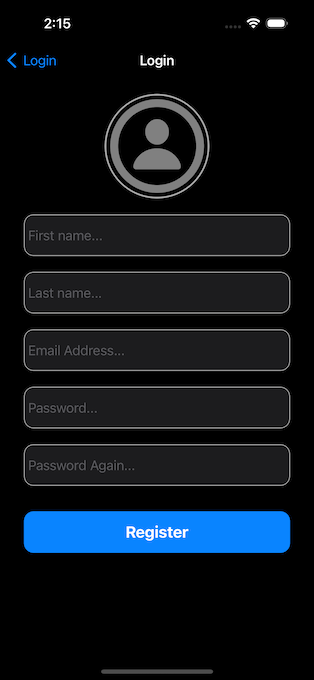
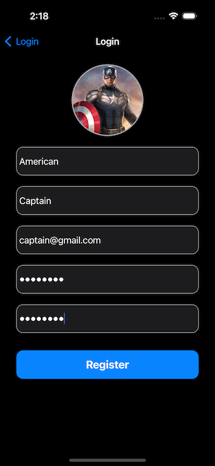

## About
This app is a Messenger clone that allows for instant chatting with others. It supports sending text, images, videos, and location messages. Firebase serves as the backend database, with Realtime Database used for storing messages and Authentication for login verification.

## Introduction
### Register
Allow users to fill out the form to register.

### Chat
You can chat with friends.

[Demo video](https://youtu.be/y-JDDeuegdU)

### Login
Provide three ways to log in.

### Search
Search for keyword "smith".

## Build
1. Drag your own GoogleService-Info.plist into the project.
2. Replace your FacebookAppID and FacebookClientToken in Info.plist file.
